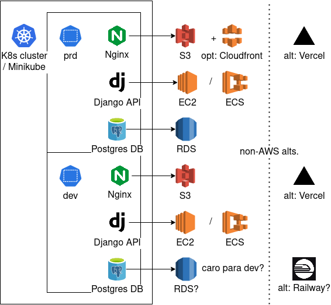

## Install

	minikube start

	git submodule update --init
		# If you didn't clone --recursive.

	make test-app-db test-app-backend test-app-frontend namespace=prd
		# Assuming master is the current branch in the submodules.

	make test-app-db test-app-backend test-app-frontend namespace=dev
		# Will bootstap dev with the chart from master.

	make loki kube-prometheus-stack # Default grafana pass is 'prom-operator'.
	make gitlab-runner

## Diagram

